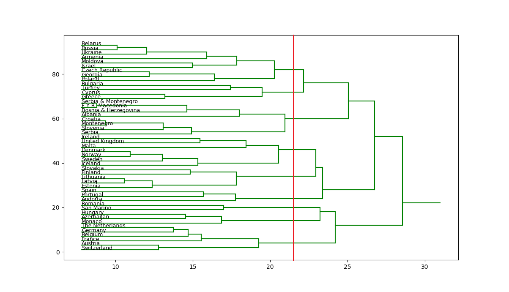
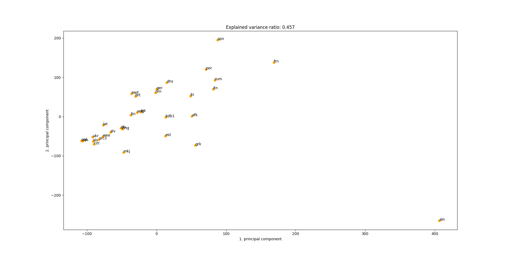
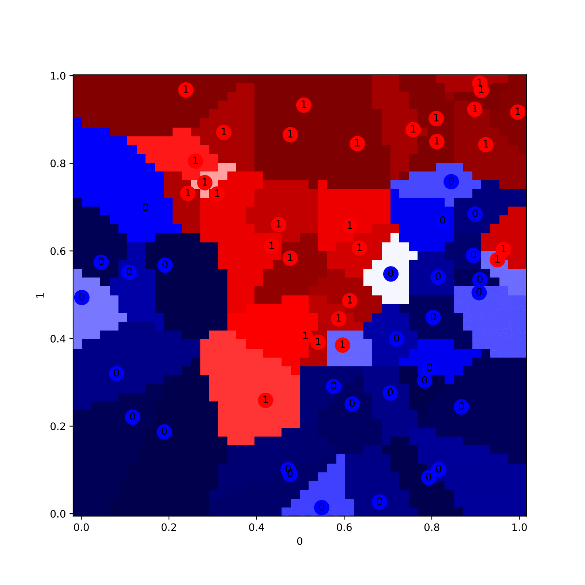

# Data Mining Examples

## About
Python programs we developed for particular scenarios using various data mining and machine learning approaches. 
Homework for the Introduction to Data Mining course at the University of Ljubljana, Faculty of Computer and Information Science. 
The course covered the following topics: clustering, linear regression, regularization, classification, recommender systems and affinity analysis.

Examples also include a short report in the Slovenian language. Following is a summary of the content. 

## Hierarchical Clustering
Analysis of the voting behaviour of the Eurovision song contest finals ([data](https://data.world/datagraver/eurovision-song-contest-scores-1975-2019)). 
Using complete-linkage hierarchical clustering we sensibly grouped the countries that prefer voting for each other.
Results are visualised by a dendrogram (the red line denotes the clusters' cutoff point).

## K-medoids
Analysis of indo-european languages. For data, we took 31 of the Universal Declaration of Human Rights [translations](https://www.ohchr.org/en/human-rights/universal-declaration/universal-declaration-human-rights/about-universal-declaration-human-rights-translation-project). 
Using the partitioning around medoids (PAM) algorithm we grouped languages into five linguistic groups based on their similarity. 
Additionally, we implemented language detection by calculating cosine similarity between descriptors vectors.

Mediods are marked with a \*, numbers denote the distance to the group medoid:
| group 0  | group 1   | group 2  | group 3  | group 4   |
|----------|-----------|----------|----------|-----------|
| afk 0.57 | aln 0.71  | eng 0.67 | *gls 0.0 | czc 0.15  |
| brt 0.67 | hng 0.75  | est 0.78 |          | mkj 0.49  |
| *dns 0.0 | *kdb1 0.0 | frn 0.39 |          | pql 0.49  |
| fri 0.56 | trk 0.56  | grk 0.7  |          | rus 0.49  |
| ger 0.5  |           | itn 0.5  |          | *slo 0.0  |
| nrn 0.24 |           | lat 0.74 |          | slv 0.47  |
| swd 0.36 |           | ltn 0.64 |          | src3 0.41 |
|          |           | por 0.33 |          | ukr 0.49  |
|          |           | rum 0.54 |          | wee 0.5   |
|          |           | *spn 0.0 |          |           |

## PCA
Using the power iteration method, we applied the Principal component analysis (PCA) to the same Human Rights language data as in the previous example.
With it we reduced the number of dimensions of the dataset to two (first and second principal components) that best describe the data (preserve high variance). 

Bellow, we visualise the projected data with a 2D plot. 
The first two principal components can explain almost half of the data variance and a few clusters can be observed.

## Linear Regression
Using linear regression we implemented an algorithm for predicting the buses' arrival time at their last station. 
The dataset of Ljubljana city's public transport contained training data for 11 months as well as 1 month with unknown arrival times. 
The latter was used for the testing - we submitted the predictions to the server and it returned the mean absolute error (MEA) of predictions in seconds, with which we measured the success of our algorithm.
We were also able to test locally with cross-validation testing. The model was alternately trained on 10 months of data and tested for the MEA on the one we didn't use for training. 

We defined several features with one hot encoding to describe the data examples and after experimentation produced several versions among which two proved to be the best. 
One predicts arrival times with a shared prediction model (file tekmovanje214.py) and the other one has an individual model for every bus line (file tekmovanje207.py), 
which proved to be just slightly better - 207 versus 214 seconds of MEA.

A shared model with 951 features:
* a unique ID for every bus line
* for every ID if the date is a weekday or a Saturday
* for every ID if the date is a Sunday or a national holiday
* for every ID a normalised departure hour as well as normalised departure hour squared and cubed

Individual model of a single bus line included the following features:
* if the month is a summer holiday month (June, July, August)
* if the date is a weekday or a Saturday
* if the date is a Sunday or a national holiday
* if the hour is 0, 1, 2, ..., 23
<!---
Results can be seen in the table below. 
 
| Shared     | Individual |
|------------|------------|
| 214.99     | 207.43     |
-->

## Logistic Regression
Implementation of a classifier using logistic regression with regularization.
Classifier parameters were estimated with the iterative optimization algorithm [L-BFGS](https://en.wikipedia.org/wiki/Limited-memory_BFGS).
We were given a small sample training data with multiple features to test the effects of regularization and find the optimal $\lambda$ (defines the degree of regularization) using cross-validation testing.  

The image shows the classification results of the training data with the optimal $\lambda = 0.15$. 
> :warning: Note that using the same data for learning and testing is wrong as it leads to overadjusted classifier parameters to the training data.
This is only done here for the regularization effect visualization - without regularization, the classifier would be completely accurate. 

The colour of the area denotes the probability of the data example belonging to a class 1 returned by the classifier, while the numbered circles represent its actual known class.

<!---
R2 stands for R squared, coefficient of determination measure
CA stands for classification accuracy measure

|           | learning         |cross validation|
|-----------|------------------|----------------|
| $\lambda$ | CA       | R2    | CA    | R2     |
| 0.000     | 1.000    | 1.000 | 0.833 | 0.333  |
| 0.001     | 1.000    | 1.000 | 0.767 | 0.067  |
| 0.010     | 1.000    | 1.000 | 0.817 | 0.267  |
| 0.100     | 0.967    | 0.867 | 0.817 | 0.267  |
| 0.150     | 0.950    | 0.800 | 0.850 | 0.400  |
| 0.200     | 0.950    | 0.800 | 0.850 | 0.400  |
| 0.300     | 0.950    | 0.800 | 0.817 | 0.267  |
| 0.400     | 0.950    | 0.800 | 0.800 | 0.200  |
| 0.500     | 0.950    | 0.800 | 0.800 | 0.200  |
| 0.600     | 0.950    | 0.800 | 0.817 | 0.267  |
| 1.000     | 0.950    | 0.800 | 0.833 | 0.333  |
| 10.000    | 0.917    | 0.667 | 0.683 | -0.267 |
| 100.000   | 0.867    | 0.467 | 0.517 | -0.933 |
-->
